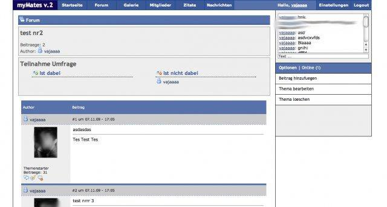
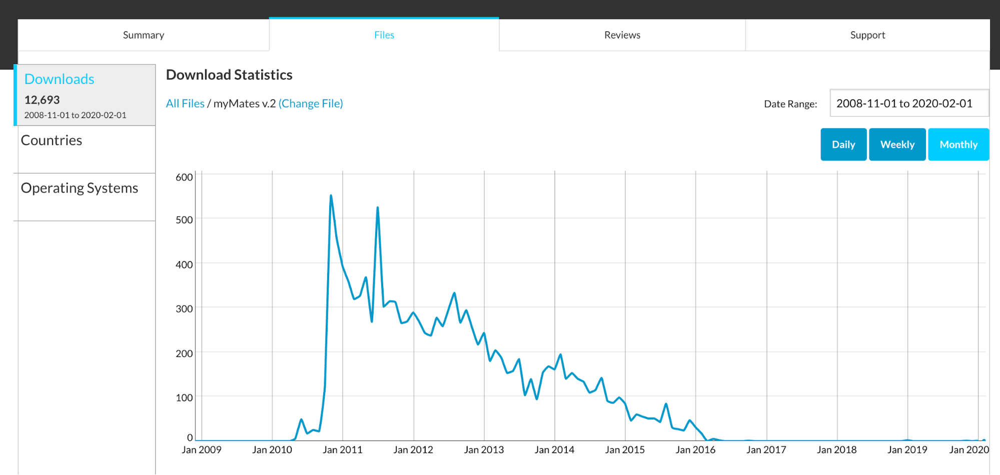

### Key takeaways:

- Building something for the people that you care about will always give you a strong purpose.
- Launching a side-project is not about HOW you solve a problem but rather about WHY you solve a problem.
- Coding is like lego – go one step at a time and learn it while you do it. You will find everything you need online.

---

Back in 2006 when I was still in high school, there were various regional social networks in Germany. Facebook just entered the social network market. The most dominant player was StudiVZ, which was specifically targeting students and pupils, very much like Facebook.

At that time my hometown friends and I were into online gaming. To better communicate and coordinate our games, I started to build websites with message boards. Designing these websites, I picked up how to write HTML, script PHP, and persist information in MySQL databases. Early, in the beginning, I was lucky that I got to know people who helped me with troubleshooting. Nevertheless, PHP and MySQL were very popular at that time so I was able to readily find a lot of online resources on how to solve my issues. I started to copy features from other websites and built them myself for our website (e.g., chats, personal profiles).

Figure 1. Gaming website

Since my friends became my first users, I always had immediate feedback and I relaunched the website several times with different feature sets and new designs (designs came from the group). I would soon start to realize that not every feature really solved a problem or much less addressed any need of this group. Though, the more features I designed the more I started to understand data structures and algorithms. Eventually, the website became a private social network where we had a message board, a news feed, a chat, a photo gallery, a quotation repository, and a polling feature.

Figure 2. myMates - private social network

My friends and I used the website on a daily basis. I started to realize that the big social networks were not covering this specific niche for private friend groups. Moreover, there was more privacy on this self-hosted platform. To test the hypothesis that there was a niche for a product like this I [uploaded the source code on SourceForge](https://sourceforge.net/projects/mymates/) (a platform for open-source projects). I described the project, added a few screenshots and just waited for what would happen. Over the course of five years, the source code was downloaded more than 12k times.

Figure 3. Downloads of myMates on SourceForge

It came as a surprise to me that people were interested in the product. Yet most of the installations came from other developers who studied the codebase. Nevertheless, I still feel like this side-project had merit for a small community of real users. For example, I got an email from a church community that hosted an instance for their kids to have a safe place for them on the internet.

Although I never managed to monetize the product and due to my bachelor studies the project halted, I still learned a lot from this experience. I came to the conclusion that there is no right or wrong way to build something. If it is interesting to you, you should just start doing it in your own way. Money and attention can be a motivation but ideally you are interested in what you do. So much that you are willing to do it for free as long as it serves a purpose.
