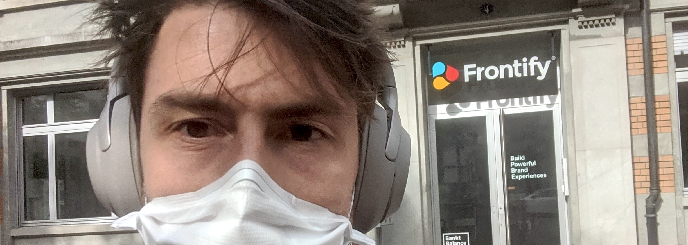

### Key takeaways:
- Networking is not a directed method. The goal of networking is to stay in contact with people to increase your luck surface. 
- Try to get in a position where you do not depend on a job interview. Try to hedge your options. 
- LinkedIn is a great platform to find job offers. Try to reach out to people directly on LinkedIn.  
- Referrals are the most effective way to get a foot in the door.

---

Looking for a job during the COVID-19 pandemic was a challenging endeavor. When I set out to find a job, my goal was relatively straightforward. I wanted to land a job in product management at one of the top tech companies (e.g., Google, Amazon, Facebook, Snapchat, etc.). My motivation to join a big tech company stemmed from the idea that I wanted to become a better product manager by learning from the industry's best people.  In my past experiences, we were continually trying to figure out the next best move to conquer the market and find product-market-fit. Therefore, I wanted to finally set foot in a company where I could take responsibility for an established product and work on more impactful issues. Especially, taking over responsibility was a very important job requirement for me. I firmly believe that your personal growth depends on the amount of responsibility you are willing to carry. As with responsibility, you increase the exposure for your work.

Overall, my job search campaign ran for around five months (April to September 2020). I also spent some time preparing my Ph.D., which I  successfully defended in June 2020. But I mostly focused on the job search. During this period, I sent out roughly 180 applications, I got invited to 20 interviews (11%), and I ultimately got 4 job offers (2%). Among the interviews I had, there were also companies like Bolt, Hubspot and Google, where I got rejected after having interviews. But overall, it felt tough to get a foot in the door at the giants. I had referrals for Facebook, Amazon, Booking, and so on. Yet, I got rejected most of the time. I talked to multiple product managers in the industry. And the consensus was that COVID took a toll on these companies. Even though there were companies that were doing great under COVID. Nobody really could predict how this would affect the economy in the long run. Therefore, the job market situation was an oversupply of more experienced product managers meeting an overall low demand. 

Yet eventually, my job search concluded with a job at Frontify. A scale-up from St. Gallen Switzerland with around 150 employees. Frontify is not a company that I previously knew. I found Frontify's Technical Product Manager job description through LinkedIn. After going through my first rounds of interviews, I started to research and get a better idea of what Frontify is doing. Whereas for other interviews, I was thoroughly prepared, and some interviews failed because I was just overly excited. The less you depend on a job interview (i.e., the less you think this is my only shot at a great job), the more likely you are to act natural and authentic and give the interview your best. Another learning that I took from this process was that your network is critical when exploring job opportunities. The easiest way to get an interview was when I already knew someone who had a contact in a company. 

During the talks with Frontify, I became more involved with the problem and understood the company's unique position. Although Frontify was not the big tech company that I was initially looking for, I realized that the job at Frontify would put me in a place where I get a lot of responsibility. Frontify is a big tech company in the making, and I get a chance at helping them to achieve their mission. Moreover, the product managers working there already laid the groundwork for a growing company. So I was excited to join this team and learn how they approach product management.  
