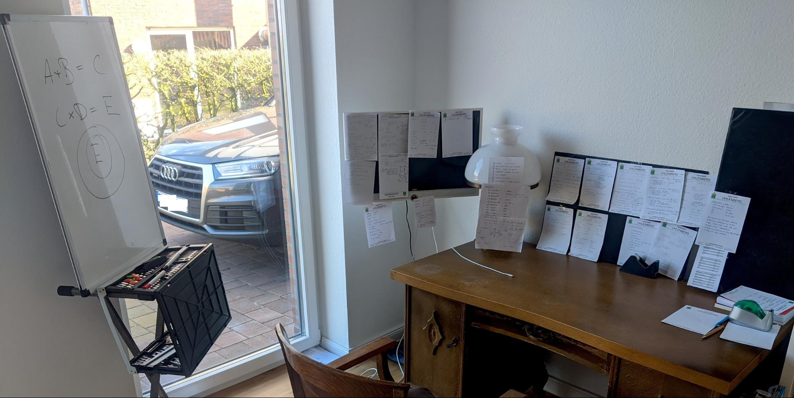

In April 2020,  I was preparing for job interviews as product manager (PM) and studied the case interview questions to prepare for interviews at top tech companies. In the following, I want to summarize my journey and write down my opinions and thoughts on some principles that were important to me and that overall guided my preparation and my job search. 

### Finding the right job is a stochastic process
You have to maximize every part of the equation to decrease your risk to end up with a job that you do not like. Your interview success is depending on how many interviews you practice and experience. Further, you should also aim to expose yourself to as many companies as possible, to not only gain experience but also to increase your chances.  

### Interview Preperation

#### Roadmap

I approached interview preparation in three different stages. My goal was to optimize towards getting as much practice as I could. Preparing for the interview is all about following a routine. Start with baby steps and get an overview. There is already lots of material available on how to prepare for product management interviews ([exponent](tryexponent.com), [Cracking the PM Interview](crackingthepminterview.com), [Decode and Conquer: Answers to Product Management Interviews](https://www.amazon.com/Decode-Conquer-Answers-Management-Interviews/dp/0615930417), [pmquestions.net](pmquestions.net), [Product Management Exercises](https://www.productmanagementexercises.com/)). 

- In the **first stage**, I worked on getting my story straight: CV, pitch (i.e., summarizing key stepstones in your career), and behavioral questions (e.g., a time you had success). Next, I tried to answer case questions by myself. I did analytical questions, product design questions, and strategic questions using pen & paper. There are a lot of resources available, and it is essential not to become frustrated. There are no right or wrong answers to these questions. 
- In the **second stage**, I tried to train case questions with friends who do not need to be related to product management. The goal was to practice structuring thoughts and also trying to improve communication while solving the questions. I have one friend in particular who is familiar with tech and has product management ambitions, so he was the perfect sparing partner. 
- Lastly, in the **third stage**, I tried to get as much practice as possible with a real product manager or people that already conducted PM interviews. This is not mandatory, but the closer you can get to the real deal, the better. 

#### Do not fail but learn
It’s part of the process to fail a case, and you should not be discouraged by that. There are two kinds of stresses that you have during job search. 
- *Bad stress*, which is rooted in not having a goal and chasing moving targets. 
- And *good stress*, which is stress stemming from your journey to achieve a goal. 
You should embrace every failed interview and every case where you were not able to come up with an answer. Those are actually the moments when you are progressing. I tried to successively minimize the number of blind spots that I had. 
When I failed a mock interview I asked for the optimal solution to this case or a structure that would have worked better (there is no entirely right or wrong answer). I wrote down this solution on a piece of paper and pinned it on the wall of the desk where I was studying.   

This solution helped me in different ways:
- **Soothing my mind**   I knew that I had all my previous best-case scenarios right in front of me. It stopped my worrying over regression and forgetting my learnings. 
- **Tracking my progress**  Making my learning tangible and growing my wall actually made me realize how much I practiced and further put my learnings at the display. Thereby, I would see the range of questions that I already covered, which motivated me. 
- **Implicit learning effect**  You should not try to learn all the structures and all the frameworks. Though what I tried to learn were information bits, which helped me to add context to every question. For example, for analytical questions, it is helpful if you can recall the equation to calculate the surface of a sphere. This is where my previous learnings helped me. 

#### Training the mix
Product management interviews are comprised of design, strategic, and analytical cases. Building a routine that covers these three types of questions was key for my prepartion. Preparing for the product management interview is similar to training for a triathlon. To do well in all three disciplines, you have to alternate between these types of interview questions. You find lots of [PM questions](https://www.productmanagementexercises.com/) and how to approach them online. 

#### Self Care
Although learning and failing is part of the process, do try to focus on the goal. Do not compare yourself to people that have been through this process. Only compare yourself to your previous self. Sticking to your routine is the most critical thing. After all, you try to find a company where you feel comfortable, do not forget that this talk is also about you feeling comfortable!

### Product Manager cases
In the following, I list my personal most important learnings:

- **Aim to have a Conversation** – The interview should resemble a journey along a tree structure. Where you are the guide and your interviewer is like a blind companion who you need to describe what you are seeing and where you both decide which route to go down next based on your assessment of the options.
- **Stay Calm** – Being calm is the greatest indicator for self-awareness and confidence. Have an agenda after the call so that you are calmer and have something to look forward to. Ideally you have multiple interviews in parallel and are equally interested in these companies. This will definitely give you confidence and give you calmness.
- **Take your time!** This was the single most important insight for me. Once you get a question, your thoughts will start to bubble up and you have to basically catch them and arrange them in a structured order. Do not force any frameworks (e.g., Porter’s 5 Forces) or have hidden agendas (1st question abt Z, 2nd question about X) as you will respond very unauthentic and the frameworks will immobilize your ideation for solutions. Jot down the thoughts that pop from the top of your head to visualize your line of thoughts. Try to put it into context and find an overarching structure that is mutually exclusive yet collectively exhaustive (MECE). This will help you to maximize saying the RIGHT things.
- **Reduce Entropy** - Your conversation should start with a verbal handshake which starts with restating the question and then asking questions. Restating the question ensures that you acoustically understand the question right and you are able to decompose the components that are important for the interviewer (as you do this write them down). Always ask questions, in the beginning, as you can understand whether the interviewer has a hidden agenda (e.g., they want you to pull information from them) or wants to explore your understanding of the question (e.g., they want to see how you handle an open-ended question and the involved degrees of freedom). State your assumptions aloud, this will help you to build a structure and establish a dialog between you and the interviewer. Whenever you feel like you could potentially lose your listener, check-in and reassure that you are going into a direction that your interviewer can follow and is interested in.
- **Diverge and Converge** – Try to always go broad and then deep. 

#### Product Design

Try to focus as much as possible on defining the precise user needs. One of the most important things to demonstrate during these cases is that you can think customer-centric. Say you are asked a very open design question such as “How would you design a supermarket?”. Here you do not indicate a customer segment whatsoever, and there are indefinite aspects of a supermarket that you could start to talk about. The problem in this case that you should solve to come up with the right user problems. Typically you start by going broad on who could be potential customers for a supermarket (think about demographics, jobs & occupations, anatomic considerations). Try to maximize the number of customer segments until they are not mutually exclusive anymore.